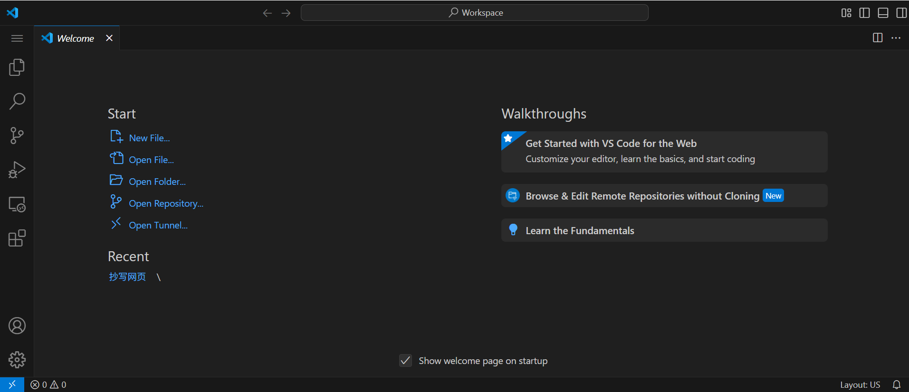
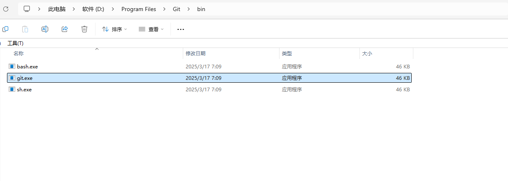
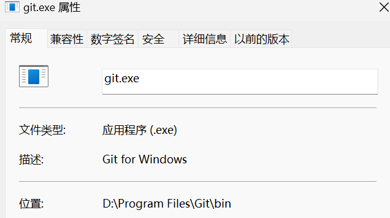
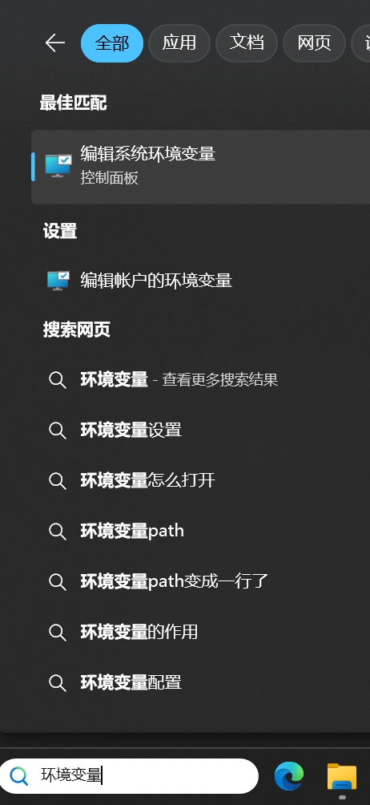
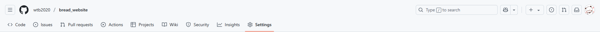
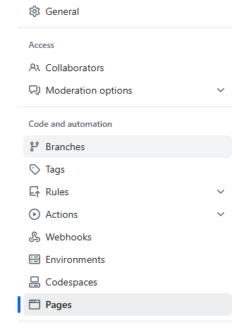
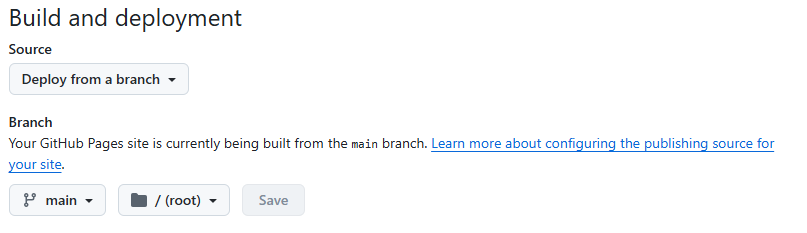

# 面包工坊静态网页

#### 	1.关于项目

​	这个项目是一个只用html和css开发出的静态网页，内容就是一个面包店的宣传网页，可以通过下面的网址访问：

​	https://wtb2020.GitHub.io/bread_website/


#### 	2.如何复刻项目

​	这个项目是根据这个视频教程一句一句抄写的，视频链接如下：

​	https://www.bilibili.com/video/BV1Wr4y1R7Bd/
​	如果视频链接失效，就可以通过哔哩哔哩搜索关键词：

```关键词
成为网页设计师的第一步！快速上手 HTML & CSS 展开你的网页设计之旅！
```

​	然后搜索结果中的该图标为教程视频：


​	实际开发时，可以不用下载vs code, 打开浏览器，输入网址：https://vscode.dev/ ，直接在浏览器中使用vs code! 

​	网页预览如下：



​	虽然只有半小时左右，但是，我一句一句暂停视频跟着超代码，然后，效果不同的，把我的代码贴给GPT进行debug，到做成差不多的效果，花了5个小时左右。但是，看到这么一个效果很棒的静态网页，觉得很开心，很有成就感！


#### 3. 关于项目如何部署到GitHub pages(win11 OS)

​	以下是我和GPT交互得到的流程，希望能对你有帮助！

##### 3.1 创建GitHub账号

- 访问 https://GitHub.com/ ，注册一个免费账号。

- 完成邮箱验证，并进行基础的信息完善。

  

##### 3.2 创建一个新的仓库

- 登录GitHub账号，点击网页右上角的加号 "+"，选择 "New repository"。

- 填写项目名称(repository name, 本例为  bread_website ) 和项目描述(description, 可以空着),

- 选择 Public(所有人可见) 或者 Private(仅自己可见)，本例为 Pubilc。

- 是否要初始化一个readme文档(就像本文档，用于介绍和说明项目)。

- 点击 "Create repository"。

  

##### 3.3 安装Git

- 从网址 https://git-scm.com/ 下载工具 Git。
- 双击下载好的安装包，安装时无脑选择 "Next"。
- 安装完成后，同时按键盘上的按键"Win"和"R"，输入 cmd，点击确定打开控制台终端，输入命令

```shell
git --version
```

判断是否安装成功，如果显示"git不是内部或外部命令，也不是可运行的程序或批处理文件。"，那应该是没有配置环境变量。


##### 3.4 配置环境变量

- 找到你安装的 git.exe 的位置，如下图：



- 右键 git.exe , 选择属性，复制位置后面的内容，本例中为： D:/Program Files/Git/bin



- 在win11菜单栏的搜索框中输入 环境变量 ，点击 编辑系统环境变量 ：



- 点击 环境变量 。
- 从弹窗的上面的用户变量中找到 path , 选中再点击 编辑。
- 在新的弹窗中，点击 新建，粘贴你前面复制的内容，本例中为： D:/Program Files/Git/bin
- 然后一直点 确定。
- 打开控制台终端，输入命令

```shell
git --version
```

判断是否安装成功，如果显示git的版本号，则配置成功。


##### 3.5 将你的项目push到GitHub

- 打开控制台终端，输入命令到项目地址，本例为：E:/项目/抄写网页

```shell
e:
cd E:/项目/抄写网页
```

需要说明的是，输入一行命令，就按一下按键 Enter 。

- 输入命令，初始化本地的git项目仓库

```shell
git init    
```

- 输入命令，把项目文件夹中的所有文件都添加到这个git仓库中

```shell
git add .
```

- 输入命令，提交变更记录，并设置本次提交的名字，本例为： first commit

```shell
git commit -m "first commit"  
```

- 输入命令，创建主流分支 main

```shell
git branch -M main
```

- 输入命令，将本地的git项目仓库远程连接到GitHub网站上创建的项目仓库网址：

  https://GitHub.com/your-username/your-repo-name.git

  本例为：

  https://GitHub.com/wtb2020/bread_website

```shell
git remote add origin https://GitHub.com/wtb2020/bread_website
```

- 输入命令，将本地git中的项目push到GitHub网站上的项目仓库中！

```shell
git push -u origin main 
```

需要说明的一点是，它会在你第一次 `git push` 的时候，弹出一个浏览器窗口。浏览器会要求你登录 GitHub，并确认授权。完成后，Git 就可以自动继续上传了！

- 在你的GitHub对应的项目仓库中就可以看到你本地项目的全部项目文件了！


##### 3.6 部署你的静态网页到GitHub pages

- 在浏览器中进入你的GitHub项目仓库，本例为：https://GitHub.com/wtb2020/bread_website
- 在网页上方找到 settings，并点击。



- 在左边栏中找到 pages，并点击。



- 在网页中找到 Source, 在 Source 下面的选项中，进行如下设置：

​	Branch: main

​	Folder: / (root)



- 点击按钮 Save
- GitHub网站会给你生成一个链接：

https://your-username.GitHub.io/your-repo-name/

本例为：

https://wtb2020.GitHub.io/bread_website/

- 将你的链接复制到浏览器中，你就能访问你部署的静态网页！


##### 3.7 恭喜你！

你已经成功地完成了这几件事：

1. 开发了一个静态网页！
2. 创建了一个GitHub项目！
3. 使用git工具将项目push到了GitHub！
4. 成功部署了你的网页！

现在你可以将你的链接分享给亲朋好友，让他们来访问你设计的网页！

